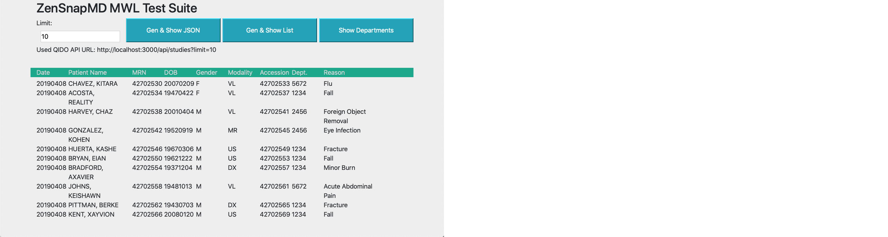
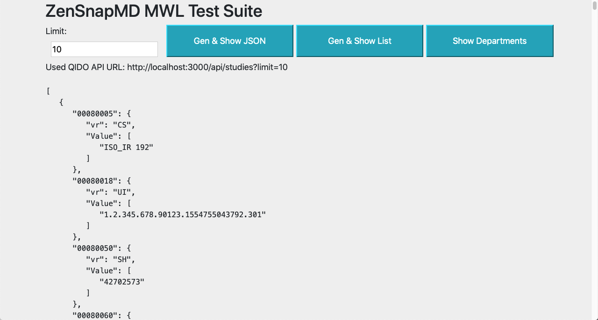

# dcmWebMwlTestGen

## Modality Worklist Test Generator and QIDO Server System

Manabu Tokunaga, GitHub: imanabu
Version 0.0.1

Note this is still very bare bone but I plan to add more functionality as we build more 
complex tests. Please provide your ideas in the Git Issues.

This is a simple Node/Express app to generate a bunch of visits with hospital departments 
associated, and serve them up via the DICOM QIDO /studies API. Because I do need to map the 
departments with real existing ones at the hospital, you can also configure realistic 
clinical departament configurations as well. 

## What It Does

It auto-generates fairly realistic Modality Worklist entries for testing the workflow. We often need
to test this from the MWL all the way to acquisition in our mobile photo app ZenSnapMD.com

As such you can also use this to generate visits to feed the rest of your test workflow.

Among the things this generates are;

* Realistic people names, correct with genders. Patient, Referring and Performing doctor names are
  generated along with fairly unique MRN, Accession and truly unique Study and Instance UIDs.
  Names are synthesized by combining the list of names from a recent US Census data, so
  even how the names sound are fairly modern.
  
  Note that MRN/Accession are time based but the top digits are truncated so it might repeat some day.
  
  The age of the patients are synthesized based on a random pick but will range from
  anywhere from 0 to 95 years old based on the date of generation. We could be more
  realistic and use a standard age distribution, but I did not do that (yet).
  
* Study dates are today's as you generate the worklist.

It also has a UI to show/demonstrate you what it generates and show the resulting worklist
items as a list or the raw JSON data.

### List View of the Worklist Generated

### JSON View of the Worklist Generated

## How Does It Work?

When the DICOM QIDO request is made for /studies it returns the MWL entries 
(instead of modality studies).

## How To Install, Run and Improve It

This is a NodeJS/Express project and written in TypeScript and so you would do the following.

1. Install NodeJS and npm
2. Install TypeScript 3.x or later
3. Compile and Run

Once NodeJS and npm is installed in your environment, you would do the following,

1. `npm install`
2. `npm build`
3. `npm start`
4. `http://localhost:3000` for a UI to demonstrate the data it generates
5. `http://localhost:3000/api/studies` to fire a QIDO GET for studies (worklist)

And by default it should be listening at the Port 3000 of your local system.

## What Works For This Version and What Does Not

### Bare-Bone DICOM Web QIDO-GET Behavior

`http://localhost:3000/api/studies`

We really do not need any fancy QIDO query param stuff here. So no date range query nor 
element level query is supported. (You are welcome to add those things. Just fork it.)
Go ahead and specify them but they will be ignored.

Only exception to that is that it supports `?limit=number` so that you can 
pull 100's and 1000's of entries at a time, and it will be very quick to do so. 
In this case the limit is used as a requested number of entry you'd want to generate.

The default is hardwired to 10.

Example with Limit: `http://localhost:3000/api/studies?limit=1000`

## Configuring Departments and Associated Reasons for Study

There is a department configuration file called `Config.ts` at the root of the project.
You can edit this to create various departments and some strings to select study reasons
randomly.

    [
       {
          "active": true,
          "department": "1234",
          "modalities": [ "CT", "VL" ],
          "reasons": [
             "Minor Burn",
             "Fall",
             "Cut",
             "Fracture"
          ]
       },...
    ]
       
* active: Means this entry will be used. 
* department: It can be a code or a string like ER/ED. It maps to (0008,1040)
* modalities: The modalities the department uses or requests.
* reasons: List of the list of study reasons that can happen in this department.

## About the UI

Use the [UI Client](http://localhost:3000) to see what it generates. The codes are
under [client](/client) directory. The client is compiled as ES5 target to allow
its use in not-so-modern browsers. The server uses the latest Node and ES2015.

This is also an example of writing an HTML client program. 

## Contributions Are Welcome

* For minor stuff or you are not a code but have ideas please file the request in the Git Issues.

* Please stick with Mithril.js + webpack.

* Let's keep this to work only with npm and no other build tools. 
