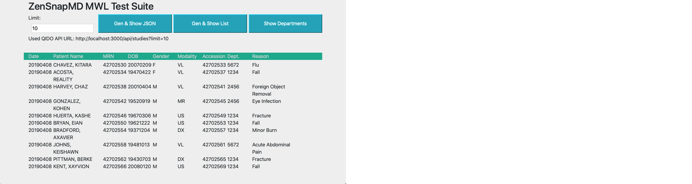
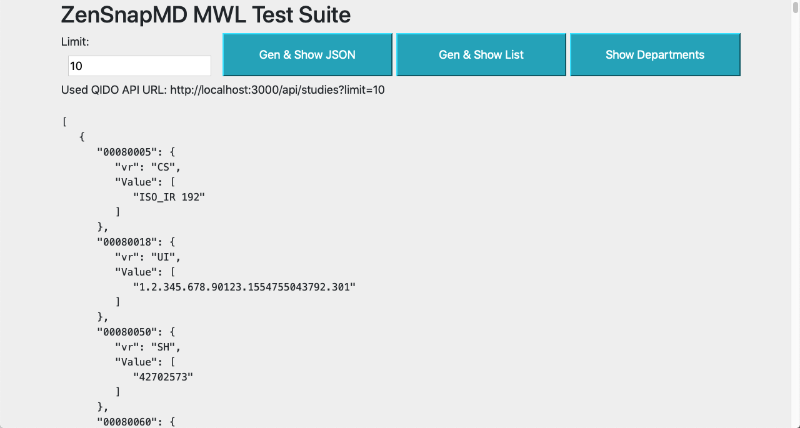

# dcmWebMwlTestGen

DICOMweb Modality Worklist test data generator.

This project is a small Node.js and Express application that generates realistic
test worklist entries and exposes them through a DICOMweb-style QIDO endpoint.
It is useful when you need test data for PACS, modality, imaging workflow, or
demo environments without setting up a full RIS, database, or hospital system.

The app also includes a browser UI for viewing generated worklist entries as a
list or as raw JSON.

## What It Generates

- Patient names, MRNs, accession numbers, study dates, and DICOM UIDs
- Referring and performing physician names
- Department-specific modalities and reasons for study
- Configurable worklist size and simulated patient flow over time
- Manually added patient-study records for matching external test systems

Generated names are synthetic and based on name lists, not real patient data.

## Quick Start

Install dependencies:

```bash
yarn install
```

Build the TypeScript server and browser client:

```bash
npm run build
```

Start the server:

```bash
npm start
```

Open the UI:

```text
http://localhost:3000
```

Fetch generated studies:

```text
http://localhost:3000/api/studies
```

## API

### `GET /api/studies`

Returns generated worklist entries as DICOM-style JSON.

```text
http://localhost:3000/api/studies
```

### `GET /api/studies?limit=100`

Returns a requested number of entries, capped by `generator.absoluteMax` in
[config/appConfig.js](config/appConfig.js).

```text
http://localhost:3000/api/studies?limit=100
```

### `GET /api/studies?hourly=25`

Changes the simulated hourly patient generation rate for that request.

```text
http://localhost:3000/api/studies?hourly=25
```

### `GET /api/departments`

Returns the configured department, modality, and study reason data.

```text
http://localhost:3000/api/departments
```

### `POST /api/study/add`

Adds a custom patient-study record to the generated worklist.

Example body:

```json
{
  "accession": "ACC12345",
  "dob": "1980-01-01T00:00:00.000Z",
  "gender": "O",
  "mrn": "MRN12345",
  "modality": "VL",
  "patientName": "SMITH^ALEX",
  "reason": "Test encounter",
  "studyDate": "2026-05-13T00:00:00.000Z",
  "studyUid": "1.2.826.0.1.3680043.10.1000.1"
}
```

## Configuration

Main configuration lives in [config/appConfig.js](config/appConfig.js).

Important settings:

- `generator.defaultMax`: default number of generated entries
- `generator.absoluteMax`: upper limit for generated entries
- `generator.hourlyPatients`: simulated patient turnover per hour
- `generator.persistConfig`: whether query parameters should persist during the server lifecycle
- `speedLimit`: request slowdown settings
- `departments`: active departments, modalities, and reasons for study

Department example:

```js
{
  active: true,
  department: "CARD",
  modalities: ["US", "MR", "DX", "VL"],
  reasons: [
    "Unstable angina",
    "Precordial pain"
  ]
}
```

Department fields:

- `active`: whether this department participates in generated entries
- `department`: department code or display name, mapped into the DICOM response
- `modalities`: possible modalities for this department
- `reasons`: possible study reasons for this department

## Development

Common commands:

```bash
npm run build
npm test
npm start
```

The server is written in TypeScript and compiled with the root
[tsconfig.json](tsconfig.json). The browser client is in [client](client) and is
bundled with webpack into `public/jsd/main.js`.

The project currently keeps generated JavaScript files in the repository. After
editing TypeScript, run `npm run build` so the generated files stay in sync.

## Running Tests

Run the full suite:

```bash
npm test
```

The package test command compiles TypeScript first and then runs the compiled
JavaScript tests. This keeps the command compatible with current Mocha and
Node.js behavior.

For IDEs that run `.ts` specs directly with `ts-node/register`, the test files
use CommonJS `require` bindings so extensionless local imports resolve reliably.

## Docker

Build an image:

```bash
docker build -t dcm-mwl-testgen .
```

Run it:

```bash
docker run --rm -p 3000:3000 dcm-mwl-testgen
```

Then open:

```text
http://localhost:3000
```

## Screenshots

List view:



JSON view:



## Project Notes

This is intentionally a lightweight test tool. It does not implement the full
DICOMweb QIDO query model. Unsupported query parameters are currently ignored.

The goal is to provide useful, realistic-enough worklist data quickly, with a
small codebase that is easy to inspect and modify.

## Contributing

Issues, fixes, and small improvements are welcome.

Before submitting a change:

```bash
npm run build
npm test
```

Please keep the project simple and consistent with the existing stack:

- Node.js
- Express
- TypeScript
- Mithril
- webpack

## License

ISC
